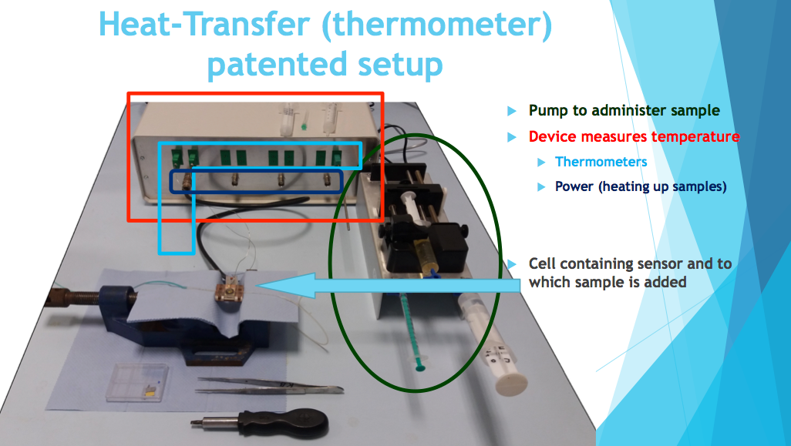
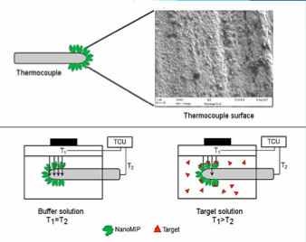
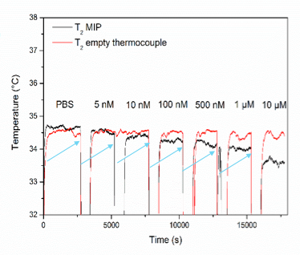

# DigitalLabs: Marloes Peeters Research Group: 12 Week Student Project

### Contact:

| For                     | Role     | Name             | Detail                                   |
| ----------------------- | -------- | ---------------- | ---------------------------------------- |
| DigitalLabs@MMU         | Supplier | Laurie Cooper    | School Of Computing, Mathematics and Digital Technology  Manchester Metropolitan University **E:** l.cooper@mmu.ac.uk **T:** 0161 247 1505 **M:** 07949 877 033 **Skype:** laurieofthecoopers@outlook.com **Postal:**   DigitalLabs@MMU W.09 The  Shed John Dalton West Chester Street  M1 5GD   |
| Peeters  Research Group | Client   | Marloes  Peeters | School Of  Science and the Environment, Manchester Metropolitan University **E:** m.peeters@mmu.ac.uk **T:** +44(0)161 247 1450 **Postal:** E427 John Dalton Building, Chester Street M1 5GD |
## Summary

DigitalLabs propose a 12-week student summer project for showcasing and visualising project data from the Peeters Research Group.

## Background

The Peeters Research Group is involved in 2 specific areas:

1. design of synthetic receptors for biomolecules of interest
2. thermal detection methods to measure these biomolecules in biological samples 

[*](https://www.marloespeeters.nl/?page_id=10)

It's the research group's aim to mature this detection method into a sensing technology for clinical diagnosis.  A generic instrument, having a disposable sensor head, containing a material targeted to the biomarker of the candidate disease; sensor run-times of less than 1 minute, and per-measurement costs of less than £1.

### Research Instrumentation

Current Instrumentation for this research effort is based on National Instruments products, and is fully functional:

A small sensor head comprises a heated copper surface, above which is a sample chamber, containing a thermocouple. 

Between the heat source and the thermocouple is a selective binding material. 

A suitable buffer solution bathes the chamber contents.

A target solution containing biomarker is introduced. 

The biomarker selectively binds to the sensor surface.

This affects its thermal conductivity: the thermocouple reading changes in a way which is predictable.

Above, the thermocouple reading of the sensor in the buffer solution remains stable, while the reading of the sensor thermocouple in the target solution drops as the concentration of the biomarker increases.

### Instrument Control

[LabView](http://www.ni.com/en-gb/shop/labview.html) software, supplied by National Instruments, controls the instrument components, holds configuration, logs data and uploads it to a cloud drive service.

## Project

### Aim

The project will provide a means to easily publish data straight from the instrument, and to browse and visualise them on-line.

### Schedule

The project will run from May/June 2018 - August/September 2018, **60 days**.

#### Requirements capture

10 days

#### Design, estimate and proposal

3 days 

#### Execution

47 days  

Execution is split into short development sprints lasting at most 10 days.

Sprints end with a release of a working product, for evaluation.

### Activities

The requirements and design phase will fully involve the research team and complete with a proposal.

The nature of the execution phase will be based on the proposal, but in general, we are expecting a brief to include:

- Interfacing to a scientific instrument, via bluetooth, or [TCP/IP](https://forums.ni.com/t5/Example-Programs/Controlling-a-VI-using-Python-using-LabVIEW/ta-p/3536468)
- extracting instrument data
- logging instrument data automatically to an on-line DB
- viewing / visualising the data via a website

### Personnel

The project will employ a suitably qualified year 2 undergraduate student at full-time, and a mentor.

Mentoring time is variable according to need. Generally:

#### Requirements capture

Student 100%

Mentor 100%

#### Design, estimate and proposal

Student 100%

Mentor 100%

#### Execution

Student 100%

Mentor 20%

### Costs

Students are charged at [Jobs4Students](http://www2.mmu.ac.uk/careers/university-staff/employ-a-student-on-campus/) hourly rate.

Mentors are charged at a [salary rate of Grade 9 , mid spine](https://www2.mmu.ac.uk/humanresources/current-staff/pay-and-reward/single-pay-spine/). 

